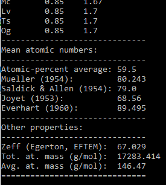

# Manuca

Manuca is a small command-line Python program to calculate various forms of the mean (or effective) atomic number and also other properties.

The name stems from it's intended use as a **M**ean **A**tomic **Nu**mber **Ca**lculator.

[![badge](https://img.shields.io/badge/Launch%20Manuca%20-on%20Binder-579ACA.svg?logo=data:image/png;base64,iVBORw0KGgoAAAANSUhEUgAAAFkAAABZCAMAAABi1XidAAAB8lBMVEX///9XmsrmZYH1olJXmsr1olJXmsrmZYH1olJXmsr1olJXmsrmZYH1olL1olJXmsr1olJXmsrmZYH1olL1olJXmsrmZYH1olJXmsr1olL1olJXmsrmZYH1olL1olJXmsrmZYH1olL1olL0nFf1olJXmsrmZYH1olJXmsq8dZb1olJXmsrmZYH1olJXmspXmspXmsr1olL1olJXmsrmZYH1olJXmsr1olL1olJXmsrmZYH1olL1olLeaIVXmsrmZYH1olL1olL1olJXmsrmZYH1olLna31Xmsr1olJXmsr1olJXmsrmZYH1olLqoVr1olJXmsr1olJXmsrmZYH1olL1olKkfaPobXvviGabgadXmsqThKuofKHmZ4Dobnr1olJXmsr1olJXmspXmsr1olJXmsrfZ4TuhWn1olL1olJXmsqBi7X1olJXmspZmslbmMhbmsdemsVfl8ZgmsNim8Jpk8F0m7R4m7F5nLB6jbh7jbiDirOEibOGnKaMhq+PnaCVg6qWg6qegKaff6WhnpKofKGtnomxeZy3noG6dZi+n3vCcpPDcpPGn3bLb4/Mb47UbIrVa4rYoGjdaIbeaIXhoWHmZYHobXvpcHjqdHXreHLroVrsfG/uhGnuh2bwj2Hxk17yl1vzmljzm1j0nlX1olL3AJXWAAAAbXRSTlMAEBAQHx8gICAuLjAwMDw9PUBAQEpQUFBXV1hgYGBkcHBwcXl8gICAgoiIkJCQlJicnJ2goKCmqK+wsLC4usDAwMjP0NDQ1NbW3Nzg4ODi5+3v8PDw8/T09PX29vb39/f5+fr7+/z8/Pz9/v7+zczCxgAABC5JREFUeAHN1ul3k0UUBvCb1CTVpmpaitAGSLSpSuKCLWpbTKNJFGlcSMAFF63iUmRccNG6gLbuxkXU66JAUef/9LSpmXnyLr3T5AO/rzl5zj137p136BISy44fKJXuGN/d19PUfYeO67Znqtf2KH33Id1psXoFdW30sPZ1sMvs2D060AHqws4FHeJojLZqnw53cmfvg+XR8mC0OEjuxrXEkX5ydeVJLVIlV0e10PXk5k7dYeHu7Cj1j+49uKg7uLU61tGLw1lq27ugQYlclHC4bgv7VQ+TAyj5Zc/UjsPvs1sd5cWryWObtvWT2EPa4rtnWW3JkpjggEpbOsPr7F7EyNewtpBIslA7p43HCsnwooXTEc3UmPmCNn5lrqTJxy6nRmcavGZVt/3Da2pD5NHvsOHJCrdc1G2r3DITpU7yic7w/7Rxnjc0kt5GC4djiv2Sz3Fb2iEZg41/ddsFDoyuYrIkmFehz0HR2thPgQqMyQYb2OtB0WxsZ3BeG3+wpRb1vzl2UYBog8FfGhttFKjtAclnZYrRo9ryG9uG/FZQU4AEg8ZE9LjGMzTmqKXPLnlWVnIlQQTvxJf8ip7VgjZjyVPrjw1te5otM7RmP7xm+sK2Gv9I8Gi++BRbEkR9EBw8zRUcKxwp73xkaLiqQb+kGduJTNHG72zcW9LoJgqQxpP3/Tj//c3yB0tqzaml05/+orHLksVO+95kX7/7qgJvnjlrfr2Ggsyx0eoy9uPzN5SPd86aXggOsEKW2Prz7du3VID3/tzs/sSRs2w7ovVHKtjrX2pd7ZMlTxAYfBAL9jiDwfLkq55Tm7ifhMlTGPyCAs7RFRhn47JnlcB9RM5T97ASuZXIcVNuUDIndpDbdsfrqsOppeXl5Y+XVKdjFCTh+zGaVuj0d9zy05PPK3QzBamxdwtTCrzyg/2Rvf2EstUjordGwa/kx9mSJLr8mLLtCW8HHGJc2R5hS219IiF6PnTusOqcMl57gm0Z8kanKMAQg0qSyuZfn7zItsbGyO9QlnxY0eCuD1XL2ys/MsrQhltE7Ug0uFOzufJFE2PxBo/YAx8XPPdDwWN0MrDRYIZF0mSMKCNHgaIVFoBbNoLJ7tEQDKxGF0kcLQimojCZopv0OkNOyWCCg9XMVAi7ARJzQdM2QUh0gmBozjc3Skg6dSBRqDGYSUOu66Zg+I2fNZs/M3/f/Grl/XnyF1Gw3VKCez0PN5IUfFLqvgUN4C0qNqYs5YhPL+aVZYDE4IpUk57oSFnJm4FyCqqOE0jhY2SMyLFoo56zyo6becOS5UVDdj7Vih0zp+tcMhwRpBeLyqtIjlJKAIZSbI8SGSF3k0pA3mR5tHuwPFoa7N7reoq2bqCsAk1HqCu5uvI1n6JuRXI+S1Mco54YmYTwcn6Aeic+kssXi8XpXC4V3t7/ADuTNKaQJdScAAAAAElFTkSuQmCC)](https://mybinder.org/v2/gh/lukmuk/manuca/bf8eae030b1c040dc5b650acbe75702eb04ac0d9?urlpath=lab%2Ftree%2FManuca-binder-notebook.ipynb)

# Quickstart and Examples

You can explore Manuca without installing anything by opening the Binder link above in a new tab.

Install the required Python packages and then run Manuca:

``pip install numpy chemparse mendeleev``

``python manuca.py``

Enter a stoichiometry, e.g. H2O and confirm with `Enter`.


Quit by entering `q`.

Chemparse can handle (single-level) parentheses, here for the [Fe-based superconductor](https://en.wikipedia.org/wiki/Iron-based_superconductor) Ba(Fe0.92Co0.08)2As2:


The `multi` compound mode is meant to handle more complex compounds, e.g. 73% of H2O and 27% of SiO2.


A more complicated random mixture of superconductors and BaZrO3: 42% YBa2Cu3O6.9, 42% Ba(Fe0.92Co0.08)2As2, and 16% BaZrO3:


To finish, let's put in the periodic system (let's call it an ultra-high-entropy alloy):


... and in the end: 



The periodic-table-elements string can be generated from `mendeleev`:

```python
from mendeleev.fetch import fetch_table
df = fetch_table('elements') #pandas data frame
print(''.join(df['symbol'].to_list()))
```

## Requirements and Installation

Manuca works by utilizing [chemparse](https://pypi.org/project/chemparse/) to evaluate the stoichiometric formula from a user input. Then, [mendeleev](https://github.com/lmmentel/mendeleev) is used to retrieve the element-specific data. NumPy is used for calculations.

- Clone or download the repository (or just `manuca.py`).

- **Optional**: Create a fresh environment:

    ``conda create -n manuca python=3.9`` 

    ``conda activate manuca``

- Install the required Python packages:

    ``pip install numpy chemparse mendeleev`` 

- Run Manuca (from the folder where the ``manuca.py`` is located):

    ``python manuca.py`` 

## Documentation

#### Output

Manuca v0.1 calculates the following outputs:

- Composition in atomic % (at.%) and weight % (wt.%)

- Mean/effective atomic numbers are calculated from the atomic numbers (), the weight fractions (), and atomic fractions (). Formulas were taken from 
  
  Howell, P. G. T., Davy, K. M. W. & Boyde, A. Mean atomic number and backscattered electron coefficient calculations for some materials with low mean atomic number. *Scanning* **20**, 35–40 (1998).
  
  - Atomic-percent average:
    
    
  
  - Müller (1954), 
    
    
  
  - Sandick & Allen (1954)
    
    
  
  - Joyet (1953) / Hohn & Niedrig (1972) / Büchner (1973):
    
    
  
  - Everhart (1960):
    
    
*    Other properties:
  
  * Egerton (effective Z for EFTEM):
    
    
    
    Eq. (5.4) from Egerton, R. F. *Electron Energy-Loss Spectroscopy in the Electron Microscope*. (Springer US, 2011). doi:[10.1007/978-1-4419-9583-4](https://doi.org/10.1007/978-1-4419-9583-4).
  
  * Total and average atomic mass/molecular weight in g/mol.
